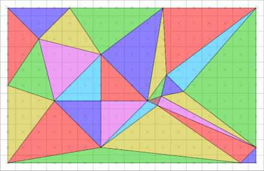

## The Automatic Satellite Imagery DataSet Generator

### Support DataSource :

* Google
* Google China
* Google Maps
* Google Satellite
* Google Terrain
* Google Terrain Hybrid
* Google Satellite Hybrid
* Stamen Terrain
* Stamen Toner
* Stamen Toner Light
* Stamen Watercolor
* Wikimedia Map
* Wikimedia Hike Bike Map
* Esri Boundaries Places
* Esri Gray (dark)
* Esri Gray (light)
* Esri National Geographic
* Esri Ocean
* Esri Satellite
* Esri Standard
* Esri Terrain
* Esri Transportation
* Esri Topo World
* OpenStreetMap Standard
* OpenStreetMap H.O.T.
* OpenStreetMap Monochrome
* OpenTopoMap
* Strava All
* Strava Run
* Open Weather Map Temperature
* Open Weather Map Clouds
* Open Weather Map Wind Speed
* CartoDb Dark Matter
* CartoDb Positron
* Bing VirtualEarth

The Satellite Imagery DataSet is important part to train, validation the model of different mission. This toolkit work for download different datasources and use specific layer (class) in OSM Vector Data to generate dataset for train or validation model.

First of all , the layer name & class should be know as prior knowledge that mean the same class maybe has different keyword in OSM data and definition.
like 'water' as a classname, but same classname in OSM data will be 'waterway','water','lake'...

### Usage:
#### Step 1:
Download the tile file is the first step. But the almost data resources supporter didn't write the projection information to tile file. So the compute tile projection infomation & write to file is most import part in process of download flow.
```python
Google=DOWNLOADER("Google")
Google.addcord(100.361,38.866,100.386,38.839,17)
Google.download()
tiles=Google.savetiles(path="./Google",format="tif")
Google.merge('./data.tif')#Merge all the tiles and generate full version file
```

`addcord()` as a function ,input is WGS cord of left-top point & right-bottom point `x1,y1,x2,y2`,additional zoom level that mean different level density of data grid.

        left, top : left-top coordinate, for example (100.361,38.866)

        right, bottom : right-bottom coordinate

        z : zoom
        filePath : File path for storing results, TIFF format


#### Step 2:
If the data use for model training, we should have label that could be generate by rasterize vector file. Normally, the data will label by artificial work.But human resources has limit in huge object label with high resolution imagery. The OSM Vector data has a worldwide version that save in sqlite based mbtiles file system that could be decode by GDAL library.

The Class `Vector` and `Raster` is important part of data I/O. Rasterisation (or rasterization) is the task of taking an image described in a vector graphics format (shapes) and converting it into a raster image (a series of pixels, dots or lines, which, when displayed together, create the image which was represented via shapes).[1][2] The rasterised image may then be displayed on a computer display, video display or printer, or stored in a bitmap file format. Rasterisation may refer to the technique of drawing 3D models, or the conversion of 2D rendering primitives such as polygons, line segments into a rasterized format.


The map data has better relative accuracy than temporary human label work that mean the vector map has potential to be ground truth. So, transform the exist vector to raster data that is indispensable method for generate training data in DL-based computer vision mission.

Rasterize:



```python
from Vector import Vector
Beijing=Vector("/workspace/data/Water/Beijing.geojson")
Beijing.getDefaultLayerbyName("Beijing")
Beijing.readtif("/workspace/SQCV/Data/IO/Google(100.36079408135292, 1.3411045076338268e-06, 0, 38.86617680812866, 0, -1.0444025902796225e-06).tif")
Beijing.Rasterize("./result.tif")

for tile in tqdm(tiles):
    Beijing.readtif(tile)
    filename=tile.split('/')[-1]
    path='./label/'+filename
    print(path)
    Beijing.Rasterize(path)
```
The normally output :
```python
# ---------------------------------------------------------------------------- #
#                                Vector Toolkit                                #
# ---------------------------------------------------------------------------- #
# ---------------------------------------------------------------------------- #
#                            TIFF process Toolkit                              #
# ---------------------------------------------------------------------------- #
-----Class TIF init without filename
-----Valid vector format : geojson
-----Meta :  {}
-----Description :  /workspace/data/Water/Beijing.geojson
-----LayerCount: 1
-----Layer : 0  Define :  Beijing 
-----LayerDictByName:
 {'Beijing': <osgeo.ogr.Layer; proxy of <Swig Object of type 'OGRLayerShadow *' at 0x7f37129c3a80> >}
-----Alread Load: /workspace/data/Water/Beijing.geojson
# -------------------------------- DEFINE DONE ------------------------------- #

```

After finish the process, script flow will generate the imagery & label(mask) data to specific folder. All the file will have index that is writed in csv or json file for training.


### Coordinate system info:

TMS Global Mercator Profile

---------------------------

	Functions necessary for generation of tiles in Spherical Mercator projection,
	EPSG:900913 (EPSG:gOOglE, Google Maps Global Mercator), EPSG:3785, OSGEO:41001.

	Such tiles are compatible with Google Maps, Microsoft Virtual Earth, Yahoo Maps,
	UK Ordnance Survey OpenSpace API, ...
	and you can overlay them on top of base maps of those web mapping applications.
	
	Pixel and tile coordinates are in TMS notation (origin [0,0] in bottom-left).

	What coordinate conversions do we need for TMS Global Mercator tiles::

	     LatLon      <->       Meters      <->     Pixels    <->       Tile     

	 WGS84 coordinates   Spherical Mercator  Pixels in pyramid  Tiles in pyramid
	     lat/lon            XY in metres     XY pixels Z zoom      XYZ from TMS 
	    EPSG:4326           EPSG:900913                                         
	     .----.              ---------               --                TMS      
	    /      \     <->     |       |     <->     /----/    <->      Google    
	    \      /             |       |           /--------/          QuadTree   
	     -----               ---------         /------------/                   
	   KML, public         WebMapService         Web Clients      TileMapService

	What is the coordinate extent of Earth in EPSG:900913?

	  [-20037508.342789244, -20037508.342789244, 20037508.342789244, 20037508.342789244]
	  Constant 20037508.342789244 comes from the circumference of the Earth in meters,
	  which is 40 thousand kilometers, the coordinate origin is in the middle of extent.
      In fact you can calculate the constant as: 2 * math.pi * 6378137 / 2.0
	  $ echo 180 85 | gdaltransform -s_srs EPSG:4326 -t_srs EPSG:900913
	  Polar areas with abs(latitude) bigger then 85.05112878 are clipped off.

	What are zoom level constants (pixels/meter) for pyramid with EPSG:900913?

	  whole region is on top of pyramid (zoom=0) covered by 256x256 pixels tile,
	  every lower zoom level resolution is always divided by two
	  initialResolution = 20037508.342789244 * 2 / 256 = 156543.03392804062

	What is the difference between TMS and Google Maps/QuadTree tile name convention?

	  The tile raster itself is the same (equal extent, projection, pixel size),
	  there is just different identification of the same raster tile.
	  Tiles in TMS are counted from [0,0] in the bottom-left corner, id is XYZ.
	  Google placed the origin [0,0] to the top-left corner, reference is XYZ.
	  Microsoft is referencing tiles by a QuadTree name, defined on the website:
	  http://msdn2.microsoft.com/en-us/library/bb259689.aspx

	The lat/lon coordinates are using WGS84 datum, yeh?

	  Yes, all lat/lon we are mentioning should use WGS84 Geodetic Datum.
	  Well, the web clients like Google Maps are projecting those coordinates by
	  Spherical Mercator, so in fact lat/lon coordinates on sphere are treated as if
	  the were on the WGS84 ellipsoid.
	 
	  From MSDN documentation:
	  To simplify the calculations, we use the spherical form of projection, not
	  the ellipsoidal form. Since the projection is used only for map display,
	  and not for displaying numeric coordinates, we don't need the extra precision
	  of an ellipsoidal projection. The spherical projection causes approximately
	  0.33 percent scale distortion in the Y direction, which is not visually noticable.

	How do I create a raster in EPSG:900913 and convert coordinates with PROJ.4?

	  You can use standard GIS tools like gdalwarp, cs2cs or gdaltransform.
	  All of the tools supports -t_srs 'epsg:900913'.

	  For other GIS programs check the exact definition of the projection:
	  More info at http://spatialreference.org/ref/user/google-projection/
	  The same projection is degined as EPSG:3785. WKT definition is in the official
	  EPSG database.

	  Proj4 Text:
	    +proj=merc +a=6378137 +b=6378137 +lat_ts=0.0 +lon_0=0.0 +x_0=0.0 +y_0=0
	    +k=1.0 +units=m +nadgrids=@null +no_defs

	  Human readable WKT format of EPGS:900913:
	     PROJCS["Google Maps Global Mercator",
	         GEOGCS["WGS 84",
	             DATUM["WGS_1984",
	                 SPHEROID["WGS 84",6378137,298.2572235630016,
	                     AUTHORITY["EPSG","7030"]],
	                 AUTHORITY["EPSG","6326"]],
	             PRIMEM["Greenwich",0],
	             UNIT["degree",0.0174532925199433],
	             AUTHORITY["EPSG","4326"]],
	         PROJECTION["Mercator_1SP"],
	         PARAMETER["central_meridian",0],
	         PARAMETER["scale_factor",1],
	         PARAMETER["false_easting",0],
	         PARAMETER["false_northing",0],
	         UNIT["metre",1,
	             AUTHORITY["EPSG","9001"]]]