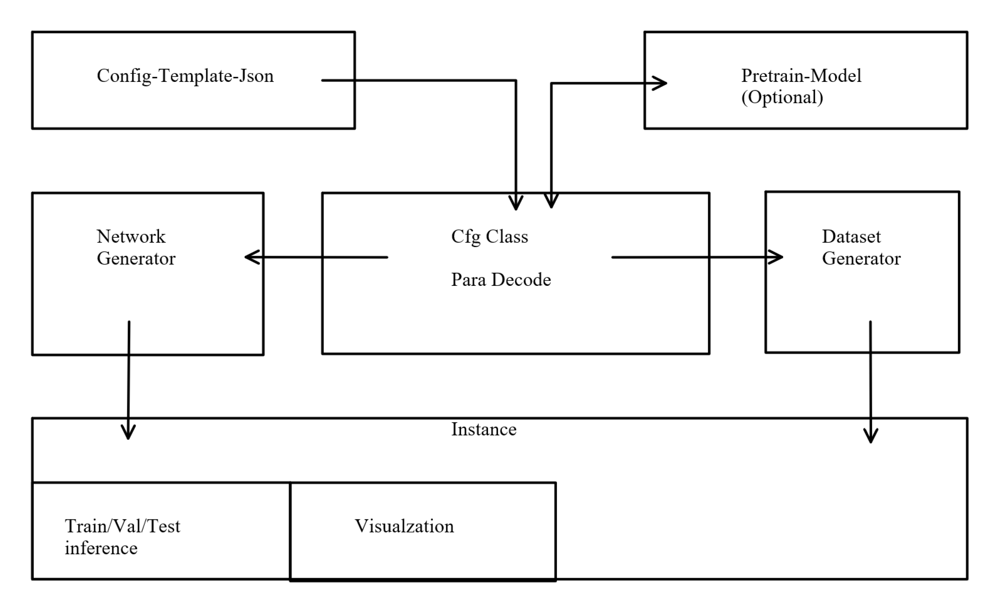

 
## WSNet Quick Training Toolkit

The main purpose of this project :

* Start a fast training instance on the standard datasets with default pre-trained model.
*  Automatic build the dataset from original images & labels with **the specified data structure rule**.
* Support for some state-of-the-art models.  
* Use Json config file configure the training instance to avoid change the project code.

****

**Project Structure：**

****

## WSNet project update log

#### Version 3.0(Beta) in 2020 Jan

* Full Functional Training,Eval
* Faster Instance Generator
* Complete Standard DataSet Support
* SOTA Algorithm Support
* DARTS Fast Training 

#### Version 2.0 

> 2019-Nov plan:

* Full Training Instance Support
  
> 2019-Oct-28

* General Instance Network & Dataset Generate

> 2019-Oct-18

* COCO Format Dataset Support
* Config Class Json System Support
* General Dataset Generator Class 

> 2019-Sep-4

* Rebuild the project structure ,decrease a lot of repetation structure

* The Network Generator have two way.

****

1.Constructs a type of model with torchvision default model

    * BackBone-                              MNASNetV1.3
    * Detection-                               Faster R-CNN model with a ResNet-50-FPN
    * Segmentation-                      DeepLabV3 model with a ResNet-50
    * Instence Segmentation-    Mask R-CNN model with a ResNet-50-FPN

With these great model ,we can start different type of mission quickly

2.Constructs a third-party / a state of arts model

Now support On:

    * BackBone-                                   EfficientNets
    * Detection                                      YoloV3
    * Segmentation                             --
    * Instence Segmentation           -- 

#### Version 1.0 (aborted)
>2019-May-4

The primary feature of WSNet toolkit in **version 1.0**:

* The custom data structure not has a standard form,so this toolkit rule a easy way to make that support for different NeuroNetwork (For Detection , Segmentation or both like Mask RCNN )

* Detection Support for :
  * Twostage (Faster RCNN ,Cascade RCNN ,Mask RCNN);
  * Onestage (YOLO v3 ,SSD);

* Segmentation Support for : 
    * Deeplab v3+，Cascade Net，Seg Net

In principle , When we run 'datasetbuild' will generate the dataset and relate configure file , if we custom our data with **Data structure RULE.**

You could modified the configure file to change option like gpu-id ，NetWork ...... or download pre-train model.

****

# Documents:

[Easy Guide to start](./Guide&#32;to&#32;start.md)

[English Version](./DocumentEN_US.md)

[中文版本](./DocumentZH_CN.md)

The MIT License
===============

Copyright (c) 2009-2016 Stuart Knightley, David Duponchel, Franz Buchinger, António Afonso

Permission is hereby granted, free of charge, to any person obtaining a copy
of this software and associated documentation files (the "Software"), to deal
in the Software without restriction, including without limitation the rights
to use, copy, modify, merge, publish, distribute, sublicense, and/or sell
copies of the Software, and to permit persons to whom the Software is
furnished to do so, subject to the following conditions:

The above copyright notice and this permission notice shall be included in
all copies or substantial portions of the Software.

THE SOFTWARE IS PROVIDED "AS IS", WITHOUT WARRANTY OF ANY KIND, EXPRESS OR
IMPLIED, INCLUDING BUT NOT LIMITED TO THE WARRANTIES OF MERCHANTABILITY,
FITNESS FOR A PARTICULAR PURPOSE AND NONINFRINGEMENT. IN NO EVENT SHALL THE
AUTHORS OR COPYRIGHT HOLDERS BE LIABLE FOR ANY CLAIM, DAMAGES OR OTHER
LIABILITY, WHETHER IN AN ACTION OF CONTRACT, TORT OR OTHERWISE, ARISING FROM,
OUT OF OR IN CONNECTION WITH THE SOFTWARE OR THE USE OR OTHER DEALINGS IN
THE SOFTWARE.
