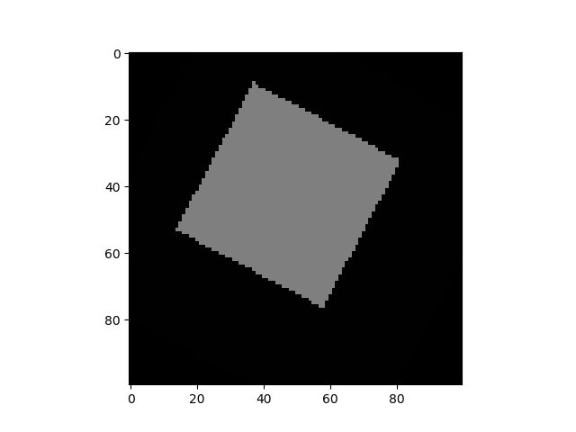

<!--
 Copyright 2020 winshare
 
 Licensed under the Apache License, Version 2.0 (the "License");
 you may not use this file except in compliance with the License.
 You may obtain a copy of the License at
 
     http://www.apache.org/licenses/LICENSE-2.0
 
 Unless required by applicable law or agreed to in writing, software
 distributed under the License is distributed on an "AS IS" BASIS,
 WITHOUT WARRANTIES OR CONDITIONS OF ANY KIND, either express or implied.
 See the License for the specific language governing permissions and
 limitations under the License.
-->


## STF-Smart Transform Module
The traditional transform process need different function ,class, parameter and random process. The smart transform will don't need set any parameter to make data augmentation with smart recognize type of mission and data.

As first of all , we need rule the format of data that input to transform . 

input `__call__` function expected two para:  
* image
`PIL image or numpy ndarray` 
* target
```python
    dict={
        
        - boxes     (FloatTensor[N, 4]): the ground-truth boxes in [x1, y1, x2, y2] format, with values between 0 and H and 0 and W
        
        - labels    (Int64Tensor[N]): the class label for each ground-truth box
        
        - masks     (UInt8Tensor[N, H, W]): the segmentation binary masks for each instance
    }
```
**Mode:**
* **Detection**


        target dict:

        - boxes (FloatTensor[N, 4]): the ground-truth boxes in [x1, y1, x2, y2] format, with values between 0 and H and 0 and W
        - labels (Int64Tensor[N]): the class label for each ground-truth box


```python
    from Src.Utils.Transform.STF import STF
    Transform=STF("Detection")
    anno=np.ones((100,100,3),dtype=np.uint8)
    img=anno.copy()*255
    anno[20:70,20:70,:]=127
    anno[80:90,:80:90,:]=233
    boxes=np.asarray([[20,20,70,70],[80,80,90,90]],dtype=np.float32)
    label=[1,2]
    target={}
    target["boxes"]=boxes
    target["labels"]=label

    image,target=Transform(anno,target)
    boxes=target["boxes"]
    print(boxes)
    x1,y1=boxes[0,0],boxes[0,1]
    x2,y2=boxes[0,2],boxes[0,3]


    import cv2
    import matplotlib.pyplot as plt
    print(x1,y1,x2,y2)
    print(type(x1),type(y1),type(x2),type(y2))
    print(type(image))
    cv2.rectangle(image,(x1,y1),(x2,y2),(255,255,0),2)
    plt.imshow(image),plt.show()


```
Here we test STF Module 3 times **without any change of code.**


* **InstanceSegmentation**


        target dict :

        - boxes (FloatTensor[N, 4]): the ground-truth boxes in [x1, y1, x2, y2] format, with values
        between 0 and H and 0 and W
        - labels (Int64Tensor[N]): the class label for each ground-truth box
        - masks (UInt8Tensor[N, H, W]): the segmentation binary masks for each instance


```python


```


* **Segmentation**


        target dict :
        
        Output [(Batch_Size),W,H,CLASS_NUM] argmax(Axis=1) with w*h*c => [(Batch_Size),W,H]
        Target [(Batch_Size),W,H] value is classes index


```python
    from Src.Utils.Transform.STF import STF
    Transform=STF("Segmentation")
    anno=np.ones((100,100,3),dtype=np.uint8)
    img=anno.copy()*255
    anno[20:70,20:70,:]=127
    boxes=[[20,20,70,70]]
    # print(anno.shape)
    # anno=Image.fromarray(anno)
    # img=Image.fromarray(img)
    # anno.show()
    target={}
    target["masks"]=anno
    image,target=Transform(img,target)
    # print(image,target)
    import matplotlib.pyplot as plt
    print(image.size(),target.size())
    
    plt.imshow(np.uint8(target.numpy())),plt.show()


```

Here ,we test 2 times **without change of code**


