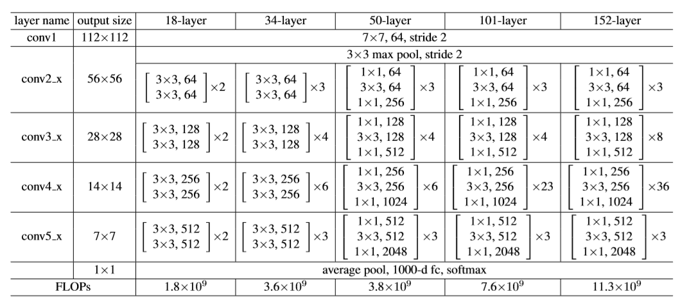
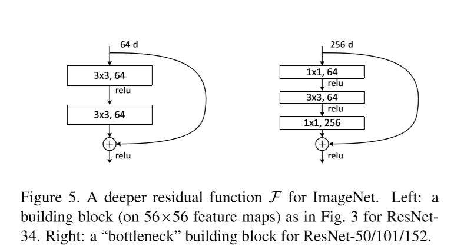

## ResNet - Pytorch Implement

\

在传统Backbone网络中，我们希望借助训练流程，得到一个满足
$$
y=H(x)
$$
的公式，既输入x数据，得到一个H(x)的输出。在VGG以及Batch-Normalization被提出的时代，由于硬件资源有限，深层神经网络因为梯度爆炸，梯度

但是何凯明在ResNet中提出，以
$$
F(x)=H(x)-X
$$
来进行表述

